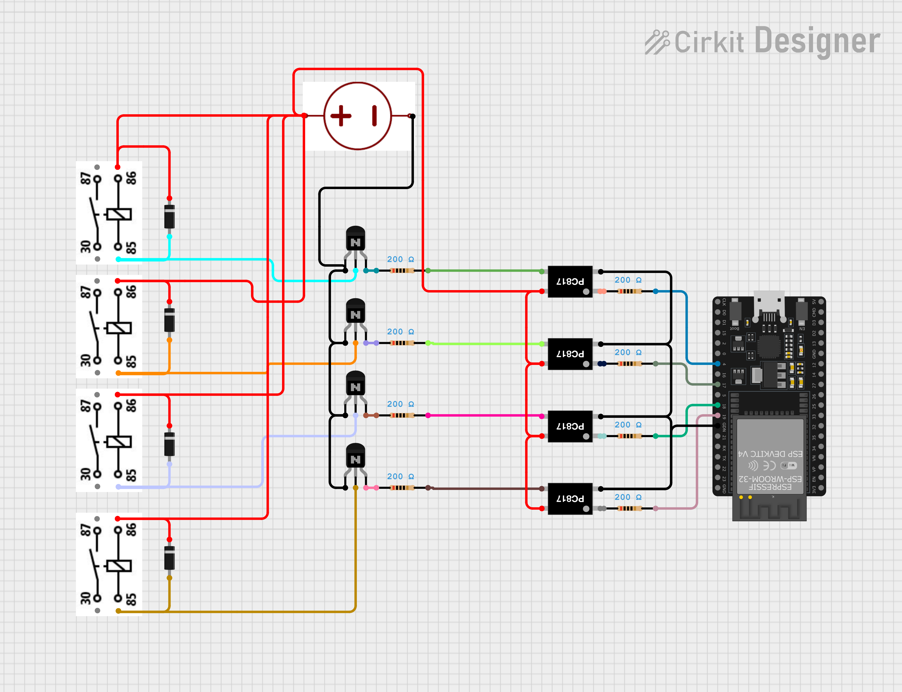
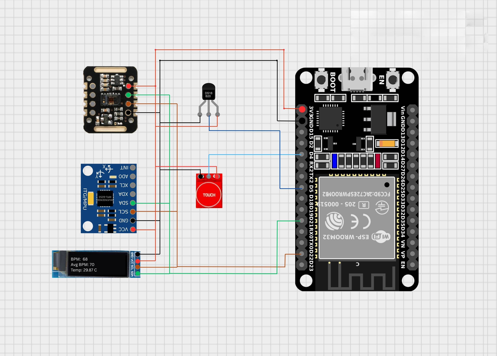

# IoT-Based Health Monitoring & Gesture-Controlled Automation System  

## 📦 Hardware Requirements  
- **ESP32 (2 units)** → One as Transmitter (TX), one as Receiver (RX)  
- **MAX30105 Sensor** → Heart rate & SpO₂ detection  
- **MPU6050 Sensor** → Motion/Gesture detection  
- **DS18B20 Temperature Sensor** → Body temperature monitoring  
- **TTP223 Touch Sensor** → Touch-based trigger  
- **4-Channel Relay Module / LEDs** → For appliance/indicator control  
- **Adafruit SSD1306 OLED Display (128x32)** → Live display of vitals on TX side  
- **NeoPixel RGB LED Strip (4 LEDs)** → Visual indication of relay states  
- **Power Supply** (5V regulated, USB or adapter)  
- Gloves for mounting the components, pcb for connecting the circuits, etc.  

## 🖥️ Software Requirements  
- **Arduino IDE / PlatformIO** with ESP32 board support  
- Required Libraries:  
  - `WiFi.h`, `WiFiUDP.h` (for ESP32 communication)  
  - `BlynkSimpleEsp32.h` (Blynk IoT platform)  
  - `MAX30105.h`, `heartRate.h` (pulse sensor)  
  - `MPU6050.h` (motion sensor)  
  - `OneWire.h`, `DallasTemperature.h` (temperature sensor)  
  - `Adafruit_GFX.h`, `Adafruit_SSD1306.h` (OLED display)  
  - `Adafruit_NeoPixel.h` (LED strip)  

---

## Receiver side circuit digram
- ** Note : The transistor shown in the circuit digram are general purpose NPN transistor with pinout in ECB (Emitter-Collector-Base) layout and not in CBE layout

## Transmitter side circuit digram

## ⚙️ Working Principle  
The **TX node** continuously reads heart rate (BPM, Avg BPM), body temperature, and motion/gesture data. This information is transmitted via **UDP** to the **RX node**.  
The **RX node** controls appliances/relays (via LEDs or real relays) and uploads all sensor data to **Blynk Cloud**, where users can monitor health parameters and relay states in real-time.  
Gesture and touch inputs allow hands-free relay control.  

---

## 🌟 Advantages  
- Real-time **remote health monitoring** through Blynk app  
- **Gesture-based appliance control**, reducing physical interaction  
- Low-power, wireless, and scalable system  
- Compact design with **OLED display feedback** at TX side  
- Can be expanded to **home automation + health monitoring**  

---

## 🚀 Future Scope  
- Integration with **mobile health dashboards** and cloud-based medical records  
- Adding **SpO₂ and ECG monitoring** for more complete health analysis  
- Using **AI/ML algorithms** for anomaly detection (e.g., arrhythmia, fever alerts)  
- Voice-assisted or AI-based control for **elderly and differently-abled people**  
- Full integration with **smart home automation ecosystems**  
